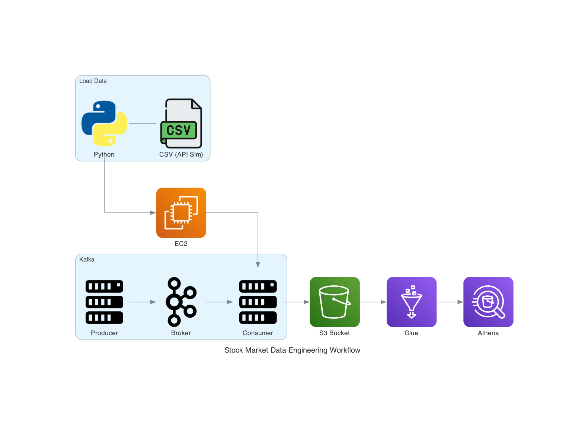

# 📈 Stock Market Kafka Real-Time (API Simulated) Data Engineering Project

## 🚀 Overview  
This project demonstrates an **end-to-end real-time data engineering pipeline** for streaming stock market data using **Apache Kafka**.  
The pipeline uses multiple AWS services for data storage, processing, and querying, alongside Python for data ingestion and orchestration.

## 🏗️ Architecture  

  

  

## 🛠️ Technologies Used  

### Programming  
- **Python**

### Cloud (AWS)  
- **S3 (Simple Storage Service)** – raw & processed data storage  
- **Athena** – interactive SQL-based queries on S3 data  
- **Glue Crawler** – schema discovery  
- **Glue Data Catalog** – centralized metadata store  
- **EC2** – compute for Kafka cluster & streaming applications  

### Streaming  
- **Apache Kafka** – real-time data ingestion & message brokering  

---

✨ This project brings together **real-time streaming, cloud services, and data engineering best practices** to simulate a stock market pipeline from ingestion to analytics.
